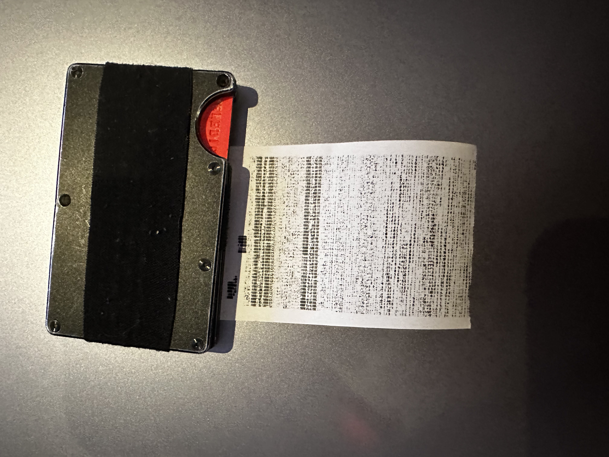
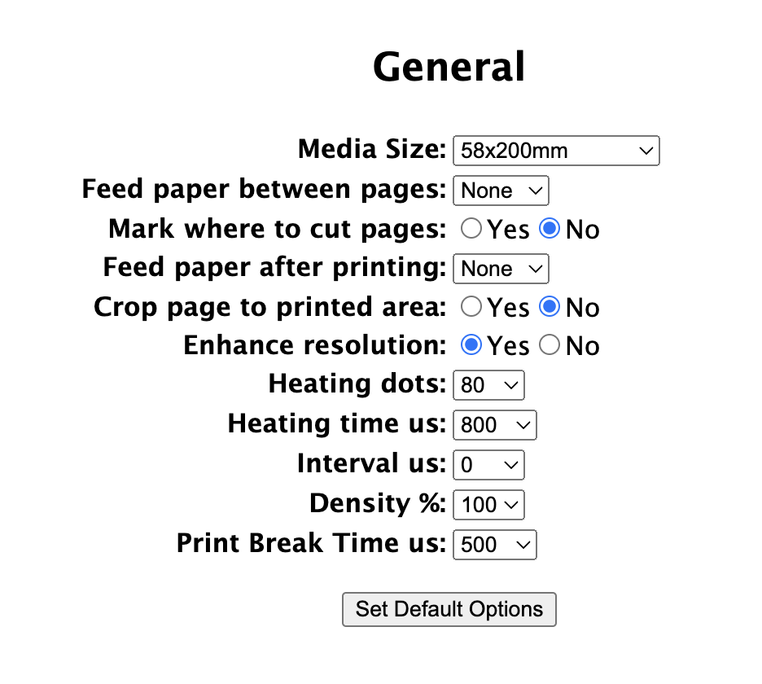
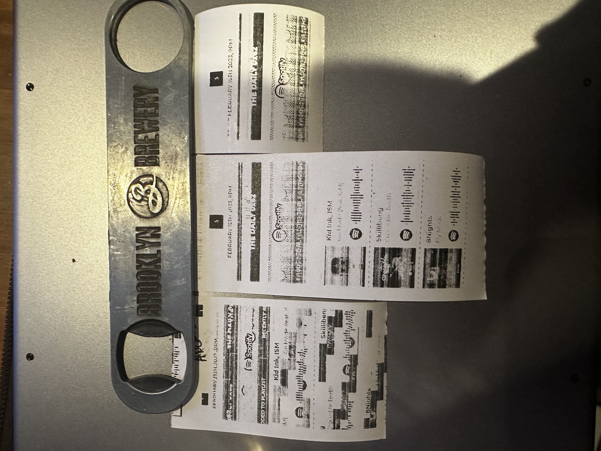
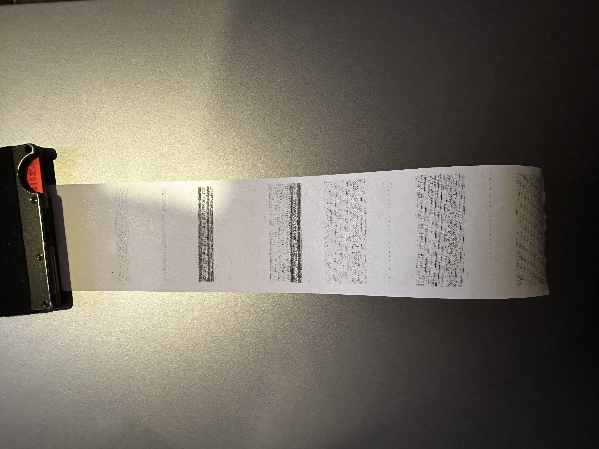

# Debug efforts for the Adafruit printer driver

## Basic setup

This is a summary of the data available on the printer selftest (holding down the button during powerup), see `img/self-test.jpg` for the full output.

```
System: A2
Version: GV2.19.08 20190326 12R
Max Dots: 80 Heat Time: 105
Baud Rate: 19200,8,N,1
Flow Ctrl: HW Flow ctrl
Line feed mode: LF(0 0A)
```

**/etc/os-release**

```
PRETTY_NAME="Debian GNU/Linux 11 (bullseye)"
NAME="Debian GNU/Linux"
VERSION_ID="11"
VERSION="11 (bullseye)"
VERSION_CODENAME=bullseye
ID=debian
HOME_URL="https://www.debian.org/"
SUPPORT_URL="https://www.debian.org/support"
BUG_REPORT_URL="https://bugs.debian.org/"
```

**$ uname -r**

```
5.15.84-v8+
```

Various images of the outputs are available in `img/`, but I will provide more context with each fix attempt. I used the same source file for each print:


This testing was done on fresh install of CUPS, with debug logging enabled.

### Adafruit driver setup

I attempted to run `gv2_thermal_printer_config.py` from the [Adafruit ZJ-58 driver](https://github.com/adafruit/zj-58), which seemed to fail:

```
ben@raspberrypi:~/zj-58 $ python gv2_thermal_printer_config.py
Setting flow control...no.
Setting baudrate...no.
```

This step is recommended by the Adafruit guide for printer versions GV2.x.

### klirichek driver

I also found this driver on Github: https://github.com/klirichek/zj-58

After installing and adding a new printer, I tried a test print which just produced garbage.



### edrosten driver

I installed this driver, and configuired the printer as below. Not pictured is the add printer step, where I selected:

```
Baud: 19200
Parity: None
Data Bits: 8
Flow Control: XON/XOFF (Software)
```



I spent a while tweaking these options to try get the best result, but see below for details on how these options seemed to affect the print results.


## Attempt 1: Paper timeout

First, I increased the paper timeout in the driver to 10 seconds, and printed the source image below twice. The first print was successful (Job 34 in `error_log.1`), the second failed half way (Job 35) with `Printer door open or no paper left`. 

On the left, is the result printing with the default Adafruit driver. In the middle, is the result of the first successful print, and on the right is the failed print.



Note the empty space in the "The Daily 0x62" banner. There are a few garbage characters in there, which seems to persist in every print. When printing longer files, these lines are present in each print at similar spacing. Adjusting the page size option in the printer configuration seems to affect the spacing of these blank lines.


## Attempt 2: Disable out of paper detection

Second, I removed the printer, reset the changes made in attempt 1, rebuilt the driver, added the printer again with the same configuration and deleted the error log.

I printed the test file again, which resulted in garbage. There was no output to the error log.

